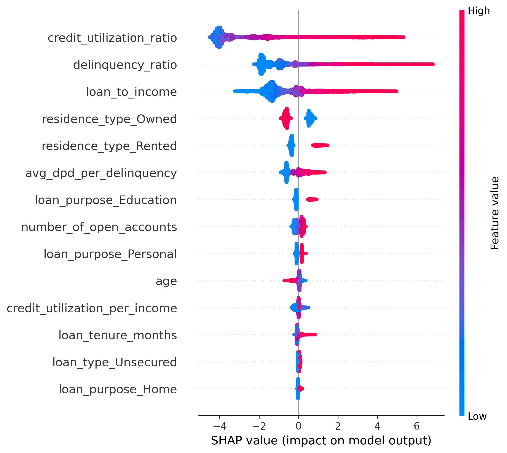
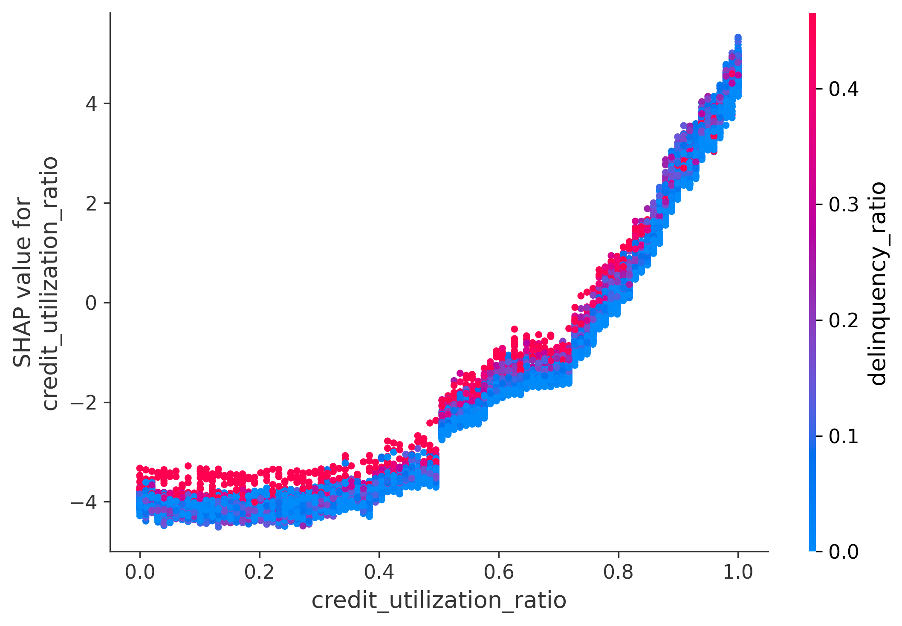
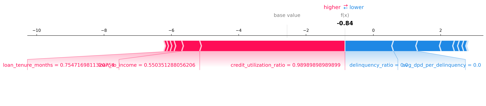

# 💳 Credit Risk Assessment System

An end-to-end Machine Learning application that predicts **borrower default probability** and generates **probability-based credit scores** using Logistic Regression. The project incorporates feature engineering, preprocessing, model optimization, and an interactive Streamlit web application to simulate a real-world credit risk assessment workflow.

---

## 🚀 Live Demo

**Application:** [Credit Risk Assessment System](https://credit-risk-modelling-4nshh.streamlit.app/)

> **Note:** The application is hosted on Streamlit Community Cloud. If the app has gone to sleep due to inactivity, click **"Yes, get this app back up!"** and allow approximately **20–30 seconds** for it to start.

---


---

## 📚 Table of Contents

- [📌 Project Overview](#-project-overview)
- [✨ Features](#-features)
- [🖥️ Application Preview](#️-application-preview)
- [⚙️ Machine Learning Pipeline](#️-machine-learning-pipeline)
- [🧠 Feature Engineering](#-feature-engineering)
- [🤖 Model Training](#-model-training)
- [📈 Model Performance](#-model-performance)
- [📈 Credit Score Generation](#-credit-score-generation)
- [🔍 Model Explainability (SHAP)](#-model-explainability-shap)
- [📊 Borrower Risk Categories](#-borrower-risk-categories)
- [🛠️ Technologies Used](#️-technologies-used)
- [📂 Project Structure](#-project-structure)
- [🚀 Running the Project](#-running-the-project)
- [💡 Skills Demonstrated](#-key-learnings)
- [🔮 Future Improvements](#-future-improvements)
- [👨‍💻 Author](#-author)

---

# 📌 Project Overview

Credit risk assessment is a critical task in the financial industry, helping lending institutions estimate the likelihood that a borrower will default on a loan.

This project builds a complete Machine Learning pipeline that predicts the probability of borrower default and converts that probability into an interpretable credit score ranging from **300–900**.

Multiple machine learning models, including **Logistic Regression** and **XGBoost**, were evaluated during development. Logistic Regression was selected as the final deployed model due to its strong predictive performance, probability estimation capabilities, and interpretability for credit risk assessment.

The application enables users to:

- Estimate borrower default probability
- Generate a probability-based credit score
- Classify borrowers into risk categories
- Explore predictions through an interactive Streamlit interface

---

# ✨ Features

- End-to-end ML pipeline
- Advanced feature engineering
- Hyperparameter optimization
- Explainable AI using SHAP
- Probability-based credit scoring
- Interactive Streamlit application

---

# 🖥️ Application Preview

<p align="center">
  
</p>

---

# ⚙️ Machine Learning Pipeline

```
Raw Borrower Data
        │
        ▼
Data Cleaning
        │
        ▼
Feature Engineering
        │
        ▼
Categorical Encoding
        │
        ▼
Feature Scaling
        │
        ▼
Logistic Regression
        │
        ▼
Default Probability
        │
        ▼
Probability-Based Credit Score
        │
        ▼
Borrower Risk Rating
```

---

# 🧠 Feature Engineering

Several domain-specific features were engineered before model training, including:

- Loan-to-Income Ratio
- Delinquency Ratio
- Average Days Past Due (DPD)
- Credit Utilization Ratio
- One-Hot Encoded Categorical Variables

The preprocessing pipeline ensures that incoming user inputs are transformed into the exact feature representation expected by the trained model.

---

# 🤖 Model Training

Multiple machine learning algorithms were evaluated during experimentation, including **Logistic Regression** and **XGBoost**.

The final deployed model uses **Logistic Regression**, a widely adopted algorithm in credit risk modelling due to its interpretability, probability estimation capabilities, and strong predictive performance on this dataset.

Hyperparameters were optimized using **Optuna** to maximize ROC-AUC while maintaining a robust and interpretable model.

---

# 📈 Model Performance

The final Logistic Regression model was evaluated on a held-out test dataset after hyperparameter optimization.

| Metric |    Score |
|---------|---------:|
| ROC-AUC | **0.98** |
| Accuracy |  **93%** |
| Precision (Default) |  **56%** |
| Recall (Default) |  **95%** |
| F1-Score (Default) | **0.71** |

The model demonstrated strong discriminative performance while maintaining interpretability, making it well-suited for probability-based credit risk assessment.

From a business perspective, **high recall is more critical than precision** in credit risk prediction, as failing to identify an actual defaulter can result in significant financial losses for lenders. With a **95% recall** on the default class, the model successfully identifies most high-risk borrowers while achieving an excellent **ROC-AUC of 0.98** and **93% overall accuracy**.

---

# 📈 Credit Score Generation

Rather than directly displaying only the default probability, the application converts the predicted probability into an intuitive **300–900 credit score**.

Workflow:

```
Borrower Features
        │
        ▼
Default Probability
        │
        ▼
Non-Default Probability
        │
        ▼
Credit Score (300–900)
        │
        ▼
Risk Rating
```

Borrowers with:

- Lower default probability receive higher credit scores.
- Higher default probability receive lower credit scores.

---

## 🔍 Model Explainability (SHAP)

To improve model transparency, SHAP (SHapley Additive exPlanations) was used to interpret feature contributions.

### SHAP Summary Plot

<p align="center">
    
</p>

The summary plot highlights the most influential features affecting borrower default predictions across the entire dataset. It shows both feature importance and whether high or low feature values increase or decrease the predicted default probability.

### SHAP Dependence Plot

<p align="center">
    
</p>

The dependence plot illustrates how changes in **credit_utilization_ratio** influence the model's prediction while revealing interactions with other features.

### SHAP Force Plot

<p align="center">
    
</p>

The force plot explains an individual prediction by showing which borrower characteristics push the prediction toward a higher or lower probability of default.

---

# 📊 Borrower Risk Categories

| Credit Score | Rating |
|--------------|---------|
| 300 – 499 | Poor |
| 500 – 649 | Average |
| 650 – 749 | Good |
| 750 – 900 | Excellent |

---

# 🛠️ Technologies Used

| Technology | Purpose |
|------------|---------|
| Python | Core programming language |
| Pandas | Data manipulation |
| NumPy | Numerical computations |
| Scikit-learn | Machine Learning pipeline |
| Logistic Regression | Final classification model |
| XGBoost | Model experimentation and comparison |
| Optuna | Hyperparameter optimization |
| SHAP | Model explainability |
| Joblib | Model serialization |
| Streamlit | Interactive web application |

---

# 📂 Project Structure

```text
credit-risk-modelling/

├── app/
│   ├── artifacts/
│   │   └── model_data.joblib
│   │
│   ├── main.py
│   └── prediction_helper.py
│
├── assets/
│   ├── demo.gif
│   ├── shap_summary.png
│   ├── shap_dependence.png
│   └── shap_force.png
│ 
├── notebooks/
│   └── credit_risk_model.ipynb
│
├── requirements.txt
├── LICENSE
└── README.md
```

---

# 🚀 Running the Project

## Clone Repository

```bash
git clone https://github.com/4nshhh/credit-risk-modelling.git

cd credit-risk-modelling
```

---

## Install Dependencies

```bash
pip install -r requirements.txt
```

---

## Start the Application

```bash
streamlit run app/main.py
```

---


# 💡 Key Learnings

This project demonstrates practical experience with:

- Machine Learning Classification
- Feature Engineering
- Credit Risk Modelling
- Hyperparameter Optimization
- Explainable AI (SHAP)
- Model Evaluation
- Model Deployment

---

# 🔮 Future Improvements

- Train and benchmark LightGBM and CatBoost models
- Support batch prediction through CSV uploads
- Integrate Docker for containerized deployment
- Deploy using Docker on AWS/GCP
- Add model monitoring and performance drift detection
---

# 👨‍💻 Author

<div align="center">

### Ansh Panchal

**Data Scientist • AI/ML Enthusiast • Open Source Contributor**

[](https://github.com/4nshhh)
[](https://www.linkedin.com/in/4nshh/)

</div>

---

⭐ If you found this project interesting, feel free to explore the repository, try the live demo, or connect with me on LinkedIn.
