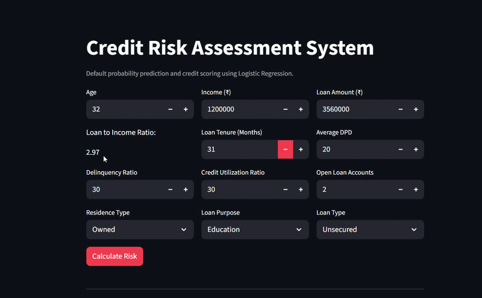

# 💳 Credit Risk Assessment System

An end-to-end Machine Learning application that predicts **borrower default probability** and generates **probability-based credit scores** using Logistic Regression. The project incorporates feature engineering, preprocessing, model optimization, and an interactive Streamlit web application to simulate a real-world credit risk assessment workflow.

---

## 🚀 Live Demo

**Application:** [Credit Risk Assessment System](https://credit-risk-modelling-4nshh.streamlit.app/)

> **Note:** The application is hosted on Streamlit Community Cloud. If the app has gone to sleep due to inactivity, click **"Yes, get this app back up!"** and allow approximately **20–30 seconds** for it to start.

---


# 📌 Project Overview

Credit risk assessment is a critical task in the financial industry, helping lending institutions estimate the likelihood that a borrower will default on a loan.

This project builds a complete Machine Learning pipeline that predicts the probability of borrower default and converts that probability into an interpretable credit score ranging from **300–900**.

The application enables users to:

- Estimate borrower default probability
- Generate a probability-based credit score
- Classify borrowers into risk categories
- Explore predictions through an interactive Streamlit interface

---

# ✨ Features

- End-to-end Machine Learning workflow
- Data preprocessing and feature engineering
- Logistic Regression classification model
- Hyperparameter optimization using Optuna
- Probability-based credit score generation
- Borrower risk categorization
- Interactive Streamlit web application
- Responsive and recruiter-friendly user interface

---

# 🖥️ Application Preview

<p align="center">
  
</p>

---

# ⚙️ Machine Learning Pipeline

```
Raw Borrower Data
        │
        ▼
Data Cleaning
        │
        ▼
Feature Engineering
        │
        ▼
Categorical Encoding
        │
        ▼
Feature Scaling
        │
        ▼
Logistic Regression
        │
        ▼
Default Probability
        │
        ▼
Probability-Based Credit Score
        │
        ▼
Borrower Risk Rating
```

---

# 🧠 Feature Engineering

Several domain-specific features were engineered before model training, including:

- Loan-to-Income Ratio
- Delinquency Ratio
- Average Days Past Due (DPD)
- Credit Utilization Ratio
- One-Hot Encoded Categorical Variables

The preprocessing pipeline ensures that incoming user inputs are transformed into the exact feature representation expected by the trained model.

---

# 🤖 Model Training

The final model uses **Logistic Regression**, a widely adopted algorithm in credit risk modelling due to its interpretability and probability estimation capabilities.

The model predicts the probability that a borrower will default.

Hyperparameters were optimized using **Optuna** to improve predictive performance.

---

# 📈 Credit Score Generation

Rather than directly displaying only the default probability, the application converts the predicted probability into an intuitive **300–900 credit score**.

Workflow:

```
Borrower Features
        │
        ▼
Default Probability
        │
        ▼
Non-Default Probability
        │
        ▼
Credit Score (300–900)
        │
        ▼
Risk Rating
```

Borrowers with:

- Lower default probability receive higher credit scores.
- Higher default probability receive lower credit scores.

---

# 📊 Borrower Risk Categories

| Credit Score | Rating |
|--------------|---------|
| 300 – 499 | Poor |
| 500 – 649 | Average |
| 650 – 749 | Good |
| 750 – 900 | Excellent |

---

# 🛠️ Technologies Used

| Technology | Purpose |
|------------|---------|
| Python | Core programming language |
| Pandas | Data manipulation |
| NumPy | Numerical computations |
| Scikit-learn | Machine Learning |
| Logistic Regression | Classification model |
| Optuna | Hyperparameter optimization |
| Joblib | Model serialization |
| Streamlit | Interactive web application |

---

# 📂 Project Structure

```text
credit-risk-modelling/

├── app/
│   ├── artifacts/
│   │   └── model_data.joblib
│   │
│   ├── main.py
│   └── prediction_helper.py
│
├── assets/
│   └── demo.gif
│
├── notebooks/
│   └── credit_risk_model.ipynb
│
├── requirements.txt
├── LICENSE
└── README.md
```

---

# 🚀 Running the Project

## Clone Repository

```bash
git clone https://github.com/4nshhh/credit-risk-modelling.git

cd credit-risk-modelling
```

---

## Install Dependencies

```bash
pip install -r requirements.txt
```

---

## Start the Application

```bash
streamlit run main.py
```

---

# 🎥 Application Preview

<!-- Add your GIF here -->

<p align="center">
  
</p>

---

# 💡 Skills Demonstrated

This project demonstrates practical experience with:

- Machine Learning Classification
- Feature Engineering
- Credit Risk Modelling
- Data Preprocessing
- Probability Estimation
- Hyperparameter Optimization
- Model Deployment

---

# 🔮 Future Improvements

- Incorporate advanced ensemble models such as XGBoost and LightGBM
- Add SHAP-based model explainability
- Integrate real-world credit bureau features
- Support batch prediction using CSV uploads
- Deploy using Docker and cloud infrastructure

---

# 👨‍💻 Author

<div align="center">

### Ansh Panchal

**Data Scientist • AI/ML Enthusiast • Open Source Contributor**

[](https://github.com/4nshhh)
[](https://www.linkedin.com/in/4nshh/)

</div>

---

## 📄 License

This project is licensed under the MIT License.
